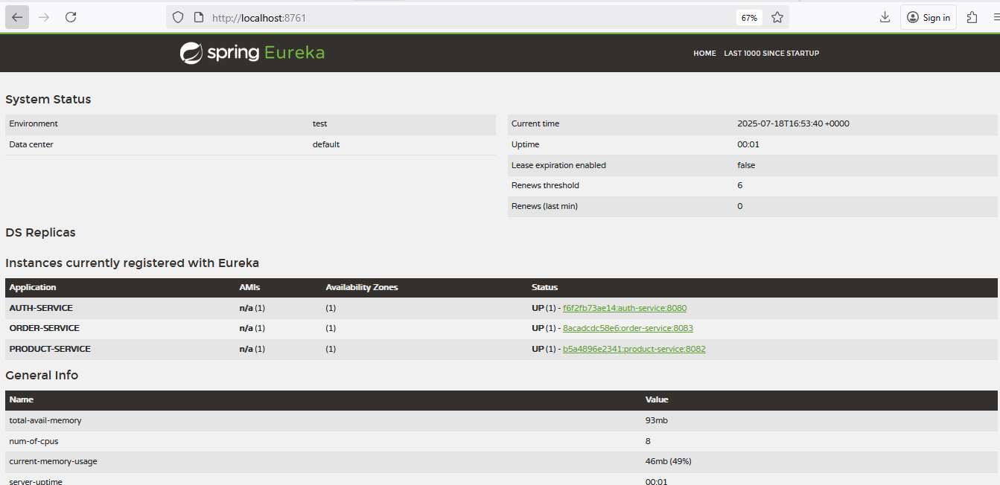
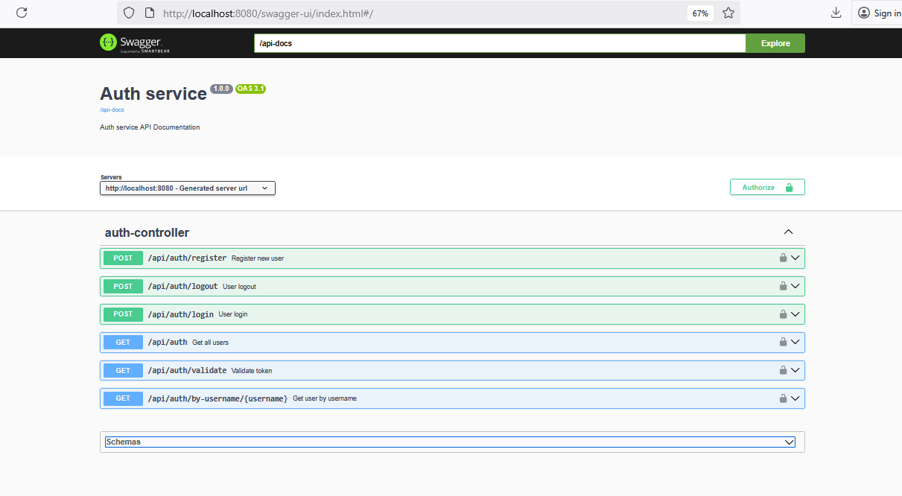
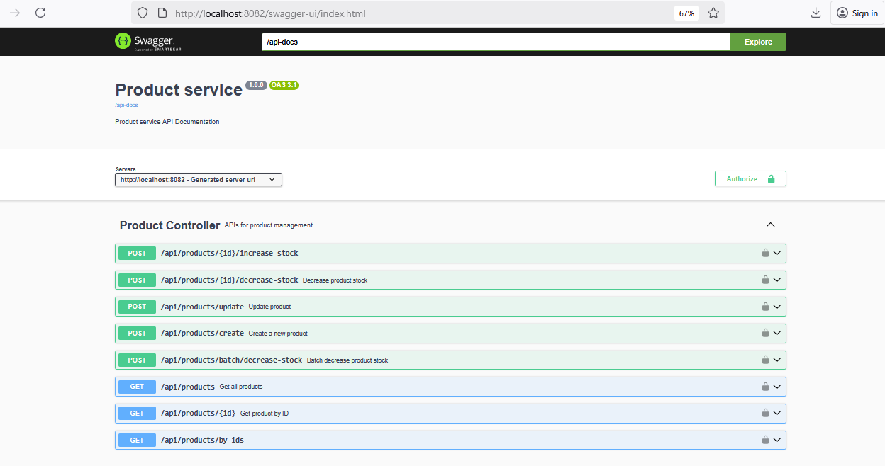
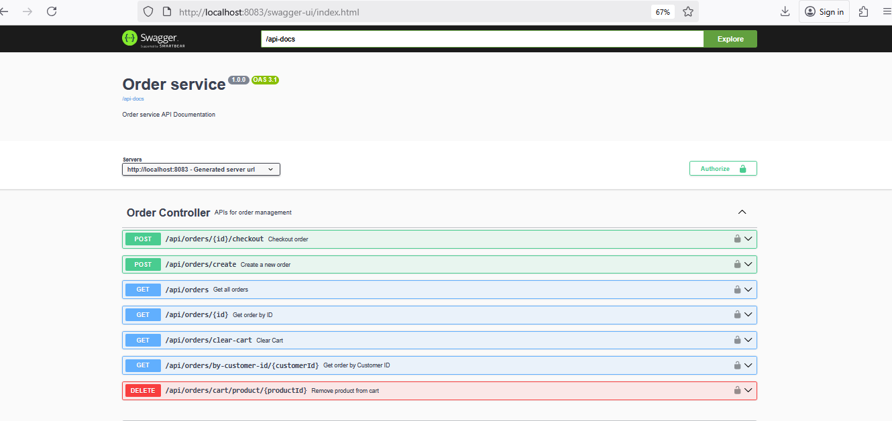

# Microservices E-Commerce Platform

### Reference Documentation

For further reference, please consider the following sections:
[](https://spring.io/projects/spring-boot)
[](https://openjdk.org/projects/jdk/21/)
[](https://www.postgresql.org/)
[](https://github.com/Netflix/eureka)

This project is a modularized Spring Boot application consisting of three core microservices: `Auth Service`, `Product Service`, and `Order Service`,
along
with a `Service Registry` and a Common module shared across all services.

### [Google Drive Link to the screen recording video for your quick reference](https://drive.google.com/drive/folders/18rccEpw4m80JAQDaTNYqzcZ1hIW8JzZb)


The system follows a microservices architecture with:

- `Service Registry`: Eureka server for service discovery
- `Auth Service`: Handles user authentication and authorization using JWT
- `Product Service`: Manages product catalog and inventory
- `Order Service`: Processes orders and shopping cart operations
- `Common Module`: Shared business and configurations

###### Mode of Communication

Services communicate via `HTTP` using `Feign clients` and are containerized using Docker.

Prerequisites

- Java 21+
- Docker 20.10+
- Docker Compose 2.33.3-desktop.1 Docker Engine 28.0.1
- Maven 3.8+

## Getting Started

1. Clone the Repository

      ```bash
      git clone <repository-url>
      cd <project-directory>
      ```
2. Make the running script executable and run it:

      ```bash
      chmod +x deploy_locally.sh
      ./deploy_locally.sh
      ```

- This script will:

    - Build all services
    - Build and containerize the postgresql database
    - Create Docker images
    - Start all containers with Docker Compose
      Services


1. Service Registry
   Description: Central service registry where all microservices register themselves and discover other services.

Access to service Registry: http://localhost:8761



2. Auth Service

- This is robust microservice for handling user authentication, JWT token management, and user profile operations,Provides endpoints for user
  authentication and authorization in a distributed system.
  Access at  http://localhost:8081/swagger-ui.html



3. Product Service

- This is a robust microservice for managing stock operations and product information in a distributed e-commerce system.

Access at  http://localhost:8082/swagger-ui.html


4. Order Service

- A microservice for managing order lifecycle in an e-commerce system, handling order placement, tracking, and cancellation .
  Access at  http://localhost:8083/swagger-ui.html
  

### Logging

The system uses SLF4J with Logback for logging. Logs can be found in:

    /app/service-name.log within each container

    Console output of each service

Log levels and formats are configured in each service's logback-spring.xml.

### Monitoring

All services include Prometheus metrics endpoints:

    /actuator/prometheus

To stop all services:

``
docker-compose down
``

